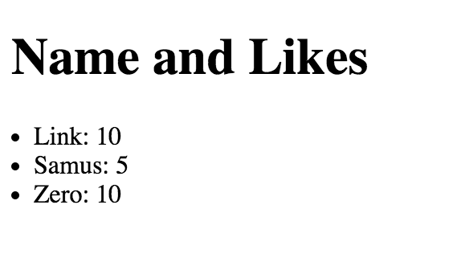

# XHR

1. Make an Ajax request to `/users` to get a collection of users.
2. Take each user and write them to the DOM like in the example below.

## Result


## Setup
1. Run `npm install`
2. Run `npm start`


## Stretch

### Solve the following problem:

- Get all user ids from `/users-ids`
- For each user, get their individual info asynchronously from `/users/:id`
- Tally their "likes", and _after_ all requests are made, display on the screen

You may _not_:

- Use a blocking while loop to wait for all responses to be done.  So no:

  ```
  while(responseCount < 20) {}
  ```

- Use any 3rd-party libraries of any sort (lodash, jQuery, Q etc...)

- Use built-in promises

- Use `setTimeout` or `setInterval` to "wait" for responses to be done.

  That is, your final result should appear on the screen as fast as possible.
